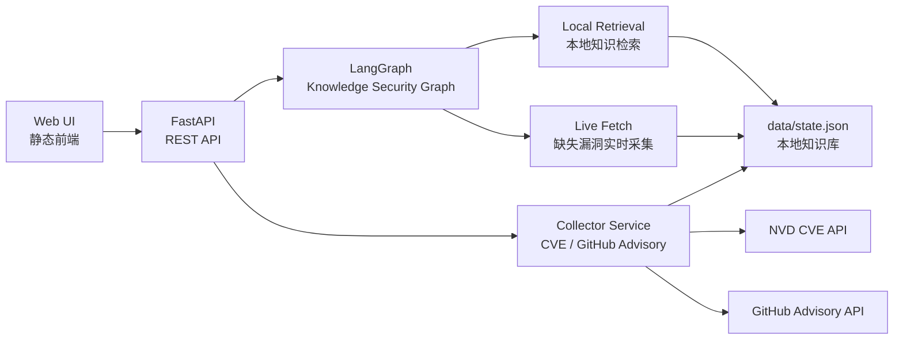

# SecFlow Knowledge Security Assistant

<p align="center">
  <b>面向 AI 安全攻防、漏洞知识库与安全研发场景的轻量级 LangGraph 知识库安全助手</b>
</p>

<p align="center">
  
  
  
  
</p>

> 作者：**ShenSiQi**  
> 许可证：**SecFlow Source-Available Commercial Non-Redistribution License**  
> 说明：本仓库源码公开用于审阅、学习和评估，但不是 OSI 意义上的开源许可证；未经书面商业授权，不允许再分发、转售、SaaS 包装或商用交付。

---

## 项目定位

SecFlow Knowledge Security Assistant 是从 SecFlow AI 平台中抽取出的精简版知识库安全助手。它保留了最核心的能力：使用 LangGraph 组织安全问答流程，通过 FastAPI 提供后端服务，通过轻量前端完成 CVE 漏洞库与 GitHub Advisory 漏洞情报采集配置，并使用本地 JSON 作为默认知识存储，便于快速部署、演示和二次评估。

它适合用于：

- AI 安全问答原型验证
- CVE / GHSA 漏洞知识库采集配置演示
- LangGraph 安全 Agent 工作流学习
- 安全研发平台的知识库助手雏形
- 内部安全工具 PoC 与轻量部署

## 核心特性

| 能力 | 说明 |
| --- | --- |
| LangGraph 安全问答 | 按 `分类 -> 检索 -> 实时补充 -> 生成答案` 组织节点流程 |
| CVE 采集配置 | 支持 NVD API URL、API Key、严重等级、集合名、最大采集量等配置 |
| GitHub Advisory 配置 | 支持 GitHub Advisory API、Token、生态过滤、严重等级、集合名等配置 |
| 本地知识库 | 默认使用 `data/state.json` 存储采集配置和漏洞记录 |
| 前端控制台 | 单页静态前端，支持问答、采集配置、测试连接、执行采集、查看 Trace |
| 密钥脱敏 | API 响应中自动隐藏 NVD API Key 与 GitHub Token |
| 低依赖部署 | 默认不依赖 Milvus、Redis、PostgreSQL 或外部 LLM |

## 架构设计



### LangGraph 节点

```text
classify_query
  -> retrieve_local_knowledge
    -> fetch_live_vulnerability
      -> compose_answer
```

| 节点 | 作用 |
| --- | --- |
| `classify_query` | 判断用户问题属于 CVE / GHSA 查询、供应链安全、合规或通用安全知识 |
| `retrieve_local_knowledge` | 从本地知识库中检索相关漏洞记录 |
| `fetch_live_vulnerability` | 当指定漏洞编号未命中时，尝试调用对应采集器补充知识 |
| `compose_answer` | 汇总检索结果、执行 Trace 与置信度，返回结构化答案 |

## 目录结构

```text
.
├── app
│   ├── collectors.py      # CVE / GitHub Advisory 采集、测试、配置保存
│   ├── graph.py           # LangGraph 知识库安全助手工作流
│   ├── main.py            # FastAPI 入口与 API 路由
│   ├── models.py          # Pydantic 请求与响应模型
│   ├── storage.py         # 本地 JSON 状态存储与密钥脱敏
│   └── static
│       ├── index.html     # 前端页面
│       ├── app.css        # 前端样式
│       └── app.js         # 前端交互逻辑
├── scripts
│   └── smoke.sh           # 最小可用性测试
├── Dockerfile             # 容器镜像构建
├── docker-compose.yml     # 单服务部署示例
├── requirements.txt       # Python 依赖
├── LICENSE                # 商业不可再分发源码许可证
└── README.md
```

## 快速开始

### 方式一：本地 Python 启动

```bash
git clone https://github.com/FuNianTongXue/secflow-knowledge-security-assistant.git
cd secflow-knowledge-security-assistant

python -m venv .venv
source .venv/bin/activate
pip install -r requirements.txt

uvicorn app.main:app --reload --host 0.0.0.0 --port 18081
```

访问：

```text
http://127.0.0.1:18081
```

### 方式二：Docker Compose 启动

```bash
git clone https://github.com/FuNianTongXue/secflow-knowledge-security-assistant.git
cd secflow-knowledge-security-assistant

docker compose up -d --build
```

访问：

```text
http://127.0.0.1:18081
```

停止服务：

```bash
docker compose down
```

### 方式三：生产环境 Uvicorn

```bash
SECFLOW_DATA_DIR=/opt/secflow-knowledge/data \
uvicorn app.main:app --host 0.0.0.0 --port 18081 --workers 2
```

建议在生产环境前面增加 Nginx / Caddy / Ingress，并将 `data/` 挂载为持久化目录。

## 环境变量

| 变量 | 默认值 | 说明 |
| --- | --- | --- |
| `SECFLOW_DATA_DIR` | `data` | 运行态配置和知识库记录存储目录 |

> NVD API Key 与 GitHub Token 默认从前端配置页写入本地状态文件，不建议提交到 Git。

## 使用说明

### 1. 打开控制台

启动服务后访问：

```text
http://127.0.0.1:18081/ui
```

页面包含三块核心区域：

- Security Assistant：输入安全问题并查看 LangGraph Trace
- Collector Configuration：配置 CVE 与 GitHub Advisory 采集源
- Knowledge Records：查看本地漏洞知识记录

### 2. 配置 CVE 漏洞库

在 `CVE Vulnerability Database` 卡片中配置：

- Enabled：是否启用采集
- NVD API URL：默认 `https://services.nvd.nist.gov/rest/json/cves/2.0`
- NVD API Key：可选，但建议配置以获得更稳定的请求额度
- Collection：默认 `cve`
- Severity Filter：如 `CRITICAL,HIGH,MEDIUM`
- Max Results：单次采集最大数量
- Interval Minutes：计划采集间隔配置项

### 3. 配置 GitHub Advisory

在 `GitHub Advisory` 卡片中配置：

- Enabled：是否启用采集
- API URL：默认 `https://api.github.com/advisories`
- GitHub Token：可选；私有速率限制场景建议配置
- Collection：默认 `github_advisory`
- Severity Filter：如 `critical,high,medium`
- Ecosystem：如 `npm`、`pip`、`maven`，可为空
- Max Results：单次采集最大数量

### 4. 提问示例

```text
Explain CVE-2021-44228
```

```text
What is the impact of GHSA-jfh8-c2jp-5v3q?
```

```text
How should we reduce software supply chain risk?
```

## API 文档

启动服务后可访问：

```text
http://127.0.0.1:18081/docs
```

常用 API：

| Method | Path | 说明 |
| --- | --- | --- |
| `GET` | `/health` | 健康检查 |
| `GET` | `/api/config` | 获取采集配置、知识库记录与统计 |
| `PATCH` | `/api/config/{collector_id}` | 更新采集配置 |
| `POST` | `/api/config/{collector_id}/test` | 测试采集源连接 |
| `POST` | `/api/collect/{collector_id}` | 执行采集 |
| `GET` | `/api/vulnerabilities` | 查看本地漏洞记录 |
| `POST` | `/api/ask` | 调用知识库安全助手 |
| `GET` | `/api/graph` | 查看 LangGraph 节点与边定义 |

采集器 ID：

```text
cve
github_advisory
```

问答请求示例：

```bash
curl -X POST http://127.0.0.1:18081/api/ask \
  -H 'Content-Type: application/json' \
  -d '{"question":"Explain CVE-2021-44228","top_k":5}'
```

## 验证与测试

安装依赖后执行：

```bash
PATH=".venv/bin:$PATH" bash scripts/smoke.sh
```

成功时输出：

```text
smoke-ok
```

也可以手动检查：

```bash
curl http://127.0.0.1:18081/health
curl http://127.0.0.1:18081/api/graph
```

## 部署建议

### 单机部署

适合 PoC、内部演示和轻量使用：

```text
Uvicorn + data/state.json
```

优点是依赖少、启动快；缺点是并发写入和审计能力有限。

### 容器部署

适合内部环境统一托管：

```text
Docker Compose + 持久化 data volume
```

建议将 `./data` 挂载到宿主机，避免容器重建后丢失采集配置。

### 平台化扩展

如果要接入企业级知识库，可将当前模块扩展为：

```text
FastAPI
  -> LangGraph
  -> Vector DB / Graph DB
  -> LLM Gateway
  -> Collector Scheduler
```

可替换方向：

- `data/state.json` 替换为 PostgreSQL / SQLite
- 本地检索替换为 Milvus / pgvector
- 采集触发替换为 Celery / APScheduler / Temporal
- 问答生成接入企业 LLM 网关

## 安全设计

- API 响应会脱敏 `api_key` 与 `token`
- `data/*.json` 默认被 `.gitignore` 忽略
- 不内置任何真实密钥
- 不默认上传采集数据到第三方服务
- GitHub 仓库公开不代表允许再分发或商用

## 路线图

- [ ] 增加定时采集调度器
- [ ] 增加 SQLite 存储选项
- [ ] 增加向量检索适配层
- [ ] 增加 LLM Provider 配置
- [ ] 增加采集任务执行日志
- [ ] 增加 Docker 镜像发布流程
- [ ] 增加更多安全知识源适配器

## 常见问题

### 这是开源项目吗？

本仓库源码公开可见，但许可证不是 OSI 开源许可证。你可以学习、审阅和评估；未经书面商业授权，不允许再分发、转售、SaaS 包装或商用交付。

### 为什么默认不用 Milvus 或数据库？

这个仓库定位是精简版知识库安全助手，目标是快速部署和理解 LangGraph 工作流。企业级场景可以按架构扩展章节替换存储层。

### 没有 NVD API Key 能用吗？

可以测试和少量采集，但 NVD 对未授权请求限制更严格。建议在配置页填写 NVD API Key。

### GitHub Token 会提交到仓库吗？

不会。Token 写入运行态 `data/state.json`，该文件默认被 `.gitignore` 忽略。

## 许可证

本项目采用 [SecFlow Source-Available Commercial Non-Redistribution License](./LICENSE)。

核心限制：

- 允许阅读、学习、评估和内部非生产测试
- 未经授权禁止再分发
- 未经授权禁止商业使用
- 未经授权禁止 SaaS / 托管服务包装
- 不得移除作者、版权与许可证声明

## 作者

**ShenSiQi**

