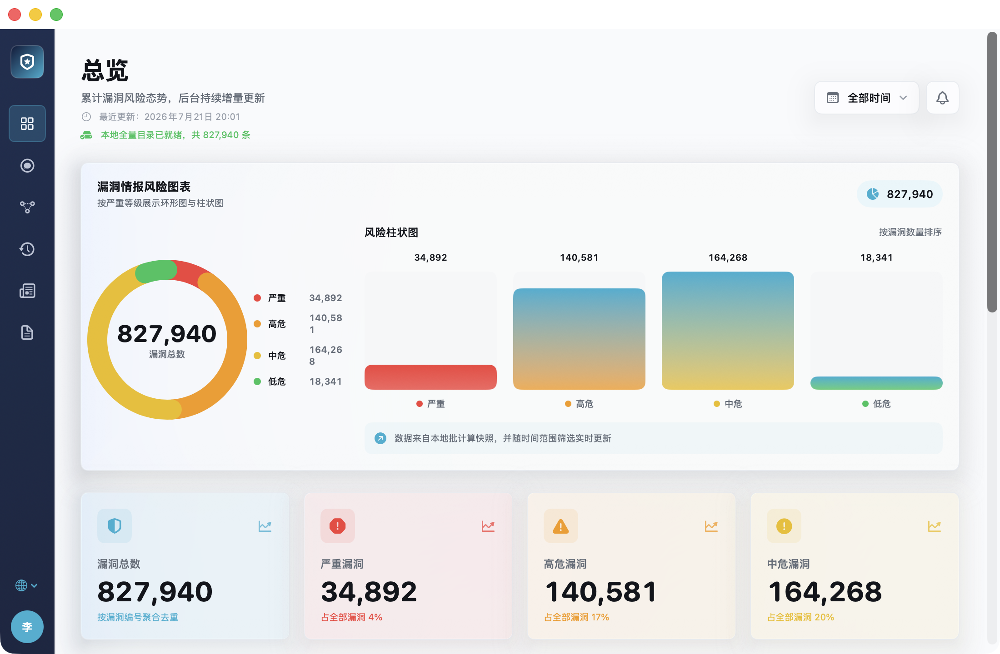
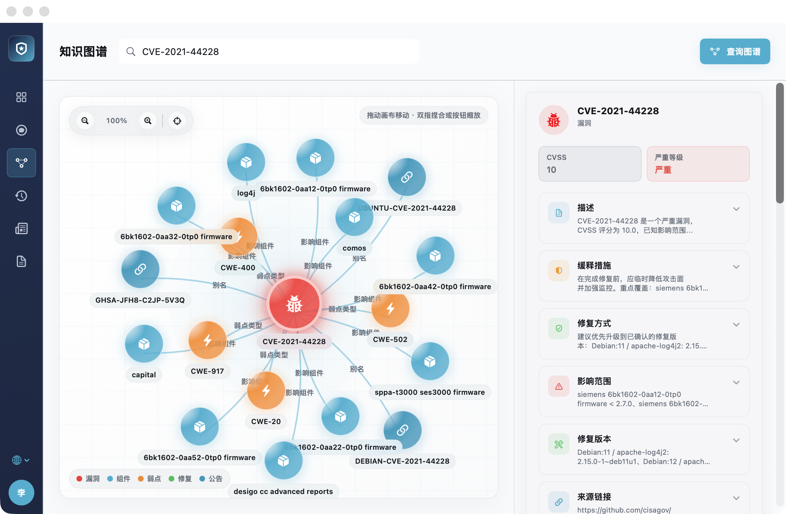
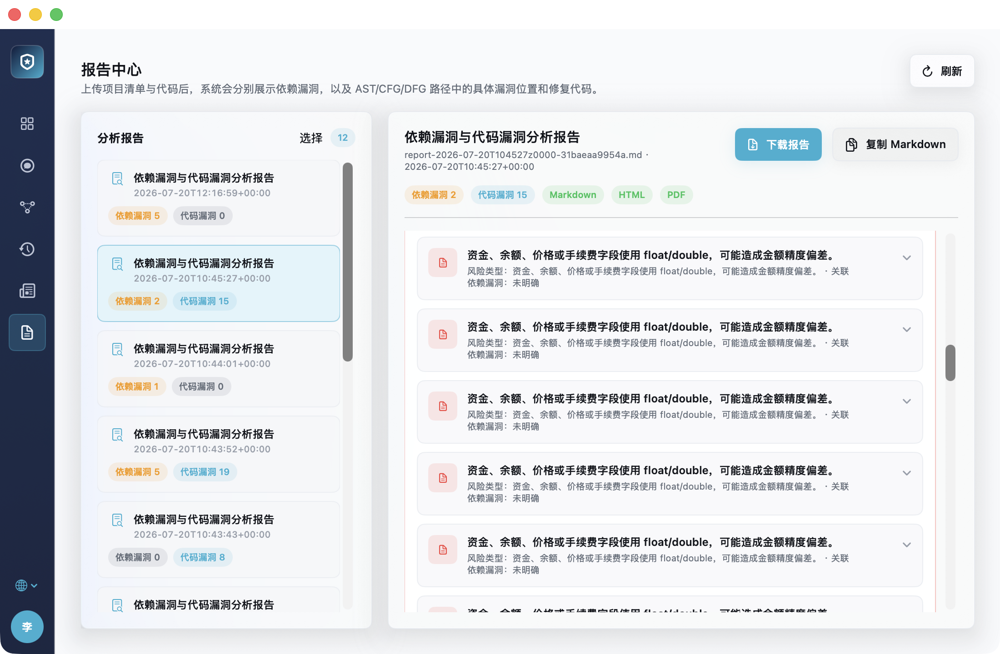
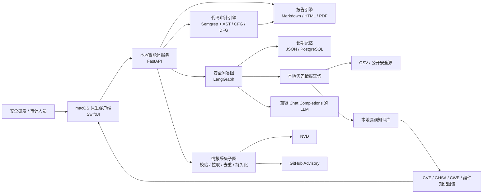

<div align="center">

<h1>SecFlow Knowledge Security Assistant</h1>

<p><strong>面向 macOS 的原生 AI 安全智能体，将漏洞情报、知识图谱、代码审计与报告交付集中到一个桌面工作台。</strong></p>

<p>
  <a href="https://www.python.org/"></a>
  <a href="https://fastapi.tiangolo.com/"></a>
  <a href="https://github.com/langchain-ai/langgraph"></a>
  <a href="https://developer.apple.com/xcode/swiftui/"></a>
  <a href="https://www.apple.com/macos/"></a>
  <a href="https://github.com/FuNianTongXue/secflow-knowledge-security-assistant/releases/tag/v1.2.0-macos-agent-trial"></a>
  <a href="./LICENSE"></a>
  <a href="https://github.com/FuNianTongXue/secflow-knowledge-security-assistant/stargazers"></a>
</p>

<p>
  <a href="#overview">项目概述</a> ·
  <a href="#highlights">核心亮点</a> ·
  <a href="#screenshots">产品界面</a> ·
  <a href="#download">下载试用</a> ·
  <a href="#architecture">系统架构</a> ·
  <a href="#quick-start">快速开始</a> ·
  <a href="#license">许可证</a>
</p>

</div>

<p align="center">
  <a href="./docs/assets/secflow-macos-dashboard.png">
    
  </a>
</p>

<a id="overview"></a>

## 📌 项目概述

SecFlow Knowledge Security Assistant 是从 SecFlow AI 平台中独立出来的 macOS 安全智能体。原生 SwiftUI 客户端负责总览、问答、资讯、知识图谱、漏洞库、代码审计和报告交付；内嵌的 FastAPI 与 LangGraph 后端负责漏洞情报检索、长期记忆、工作流编排和多语言静态分析。

项目默认可在本地运行。开发环境使用 JSON 文件保存状态与记忆；打包后的 macOS 应用使用加密存储，并通过 macOS Keychain 管理本地主密钥。模型层兼容 DeepSeek、OpenAI、Ollama、vLLM 等 Chat Completions 服务。

> [!IMPORTANT]
> 本项目是 **source-available（源码可见）** 软件，不是 OSI 定义的开源软件。源码可用于审阅、学习与评估；生产部署、商业使用、再分发和 SaaS 服务需要遵守 [LICENSE](./LICENSE) 并取得相应书面授权。

<a id="highlights"></a>

## ✨ 核心亮点

| 🧠 原生安全智能体 | 🕸️ 漏洞知识图谱 | 🔎 多语言代码审计 |
| --- | --- | --- |
| SwiftUI 桌面体验，支持长期记忆、上下文召回和中文结构化漏洞卡片 | 关联 CVE、GHSA、CWE、组件、受影响版本、公告与修复版本 | 内置离线规则与 AST / CFG / DFG 分析，覆盖 Java、Python、Go、C、C++、Rust、Solidity |
| 📡 **多源情报聚合** | 📊 **专业报告交付** | 🔐 **本地数据保护** |
| 本地优先检索，并按需补充 NVD、GitHub Advisory、OSV 与公开安全资讯 | 统一展示依赖漏洞和代码漏洞，支持 Markdown、HTML、PDF 导出 | 客户可见信息脱敏、密钥隐藏、加密状态文件、Keychain 主密钥与试用防回拨校验 |

<a id="screenshots"></a>

## 🖥️ macOS 产品界面

所有图片均来自实际运行的 macOS 原生 SwiftUI 客户端，不是 Web 控制台或设计稿。

### 漏洞知识图谱

按漏洞编号查询关联组件、弱点类型、公告、影响范围、缓释措施与修复版本。

<p align="center">
  <a href="./docs/assets/secflow-macos-knowledge-graph.png">
    
  </a>
</p>

### 分析报告中心

集中管理依赖漏洞与代码漏洞结果，并提供 Markdown、HTML、PDF 等交付格式。

<p align="center">
  <a href="./docs/assets/secflow-macos-reports.png">
    
  </a>
</p>

<a id="download"></a>

## 📦 macOS 双架构下载

版本 `v1.2.0` 提供 Apple Silicon 与 Intel 两个三天试用包。试用期从首次启动开始连续计算 72 小时。

| 平台 | 下载 | 适用设备 |
| --- | --- | --- |
| Apple Silicon `arm64` | [下载 SecFlow-Trial-3Days-macOS-arm64.zip](https://github.com/FuNianTongXue/secflow-knowledge-security-assistant/releases/download/v1.2.0-macos-agent-trial/SecFlow-Trial-3Days-macOS-arm64.zip) | M1 / M2 / M3 / M4 系列 Mac |
| Intel `x86_64` | [下载 SecFlow-Trial-3Days-macOS-x86_64.zip](https://github.com/FuNianTongXue/secflow-knowledge-security-assistant/releases/download/v1.2.0-macos-agent-trial/SecFlow-Trial-3Days-macOS-x86_64.zip) | Intel Mac；Apple Silicon 可通过 Rosetta 运行 |

最低系统版本为 macOS 14。当前发布包采用 ad-hoc 签名，未经过 Apple Developer ID 公证；首次打开时可能需要在 Finder 中右键应用并选择“打开”。校验值、完整变更与已知限制见 [v1.2.0 Release](https://github.com/FuNianTongXue/secflow-knowledge-security-assistant/releases/tag/v1.2.0-macos-agent-trial)。

试用状态由本地后端统一校验。到期、检测到系统时间回拨或状态损坏后，客户端界面将锁定，核心 API 返回 `403`。离线限时机制无法做到绝对不可破解，但删除单一状态副本或普通卸载重装不会重置试用期。

<a id="architecture"></a>

## 🏗️ 系统架构



### LangGraph 问答流程

```text
classify_query
  -> load_memory_context
    -> query_intelligence
      -> enrich_knowledge_graph
        -> call_llm
          -> translate_vulnerability_card
            -> compose_answer
              -> persist_memory
```

| 节点 | 作用 |
| --- | --- |
| `classify_query` | 区分漏洞编号、年份漏洞、供应链、合规和通用安全问题 |
| `load_memory_context` | 按用户读取长期记忆，完成历史召回和摘要压缩 |
| `query_intelligence` | 本地优先查询，按需并发补充外部结果并归并别名 |
| `enrich_knowledge_graph` | 建立漏洞、公告、CWE、组件、影响范围和修复版本关系 |
| `call_llm` | 调用兼容 Chat Completions 的模型，并保留可诊断错误 |
| `translate_vulnerability_card` | 生成固定字段的中文漏洞卡片，保护版本事实不被猜测或改写 |
| `compose_answer` | 汇总检索事实、模型分析、执行状态与置信度 |
| `persist_memory` | 保存已经过客户可见信息脱敏的问答结果 |

## 🧩 核心技术

| 层级 | 技术与职责 |
| --- | --- |
| macOS 客户端 | SwiftUI；总览、智能问答、资讯、图谱、漏洞库、报告、设置与试用状态 |
| API 与工作流 | FastAPI、Pydantic、LangGraph；REST API、问答编排、采集器子图与运行诊断 |
| 漏洞情报 | NVD、GitHub Advisory、OSV、本地 JSON 知识库、多源别名归并 |
| 静态分析 | Semgrep OSS、Tree-sitter、AST / CFG / DFG、Java 跨方法路径分析 |
| 数据与记忆 | 本地 JSON、可选 PostgreSQL、应用包内加密存储、macOS Keychain |
| 模型适配 | DeepSeek、OpenAI、Ollama、vLLM 等兼容 Chat Completions 的服务 |

<a id="quick-start"></a>

## 🚀 快速开始

### 直接体验 macOS 应用

从[发布页](https://github.com/FuNianTongXue/secflow-knowledge-security-assistant/releases/tag/v1.2.0-macos-agent-trial)下载与当前 Mac 架构对应的压缩包，解压后打开 `SecFlow.app`。应用会启动自己的回环后端，运行数据写入：

```text
~/Library/Application Support/SecFlow
```

### 从源码运行

环境要求：Python 3.11+、macOS 14+、Xcode Command Line Tools。

```bash
git clone https://github.com/FuNianTongXue/secflow-knowledge-security-assistant.git
cd secflow-knowledge-security-assistant

python -m venv .venv
source .venv/bin/activate
pip install -r requirements.txt

uvicorn app.main:app --reload --host 127.0.0.1 --port 18081
```

另开一个终端启动原生客户端：

```bash
SECFLOW_SERVER_URL=http://127.0.0.1:18081 \
swift run --package-path macos/SecFlowMac
```

### 构建独立 macOS 应用

```bash
.venv/bin/python -m pip install -r requirements-macos.txt
bash scripts/build_macos_app.sh
open dist/SecFlow.app
```

构建 Apple Silicon 三天试用版：

```bash
bash scripts/build_macos_trial_app.sh
```

构建 Intel 三天试用版时，`PYTHON_BIN` 必须指向 x86_64 Python 环境：

```bash
SECFLOW_MACOS_ARCH=x86_64 \
PYTHON_BIN=/path/to/x86_64/venv/bin/python \
bash scripts/build_macos_trial_app.sh
```

产物分别写入 `dist-macos-trial/SecFlow-Trial-3Days-macOS-arm64.zip` 与 `dist-macos-trial/SecFlow-Trial-3Days-macOS-x86_64.zip`，不会互相覆盖。详细说明见 [macOS 构建文档](./macos/SecFlowMac/README.md)。

## 🛡️ 能力清单

| 能力 | 说明 |
| --- | --- |
| AI 安全问答 | 长期记忆、跨会话召回、智能路由和模型不可用时的本地专家降级 |
| 中文漏洞卡片 | 固定输出编号、名称、描述、CVSS、严重等级、涉及版本、修复版本、修复方案、缓释措施和代码片段 |
| 事实保护 | 不把通配符解释为“所有版本”；缺少结构化证据时不猜测修复版本 |
| 实时漏洞情报 | 查询本地记录并按需补充 NVD、GitHub Advisory 与 OSV，归并后写回本地 |
| 安全资讯 | 聚合公开安全来源，支持缓存、去重、分类、搜索和来源订阅 |
| 知识图谱 | 将 CVE / GHSA、CWE、组件、受影响版本和修复版本组织成可交互关系图 |
| 依赖分析 | 解析 Maven / Gradle 项目依赖并关联已知漏洞 |
| 代码审计 | 七种语言离线规则、Java 跨方法传播及文件内 AST / CFG / DFG 路径分析 |
| 报告中心 | 统一呈现依赖与代码发现，提供 Markdown、HTML、PDF 交付格式 |
| 隐私保护 | 响应移除来源 URL、内部集合名与检索链路，API 自动隐藏密钥和 Token |

<details>
<summary><strong>常用 API</strong></summary>

启动后可访问 `http://127.0.0.1:18081/docs` 查看完整 OpenAPI 文档。

| Method | Path | 说明 |
| --- | --- | --- |
| `GET` | `/health` | 健康检查 |
| `GET` | `/api/dashboard` | 获取本地情报总览统计 |
| `POST` | `/api/ask` | 调用知识库安全助手 |
| `POST` | `/api/intelligence/query` | 本地检索、外部补充、写回并生成图谱 |
| `POST` | `/api/knowledge-graph/query` | 返回富化后的知识图谱节点与边 |
| `GET` | `/api/information` | 获取公开安全资讯 |
| `POST` | `/api/collect/{collector_id}` | 执行 CVE 或 GitHub Advisory 采集 |
| `GET` | `/api/vulnerabilities` | 查看本地漏洞记录 |
| `GET` | `/api/runtime` | 查看 LLM 与长期记忆运行状态 |
| `GET` | `/api/trial/status` | 查看三天试用状态与剩余时间 |
| `DELETE` | `/api/memory` | 清空指定用户长期记忆 |

```bash
curl -X POST http://127.0.0.1:18081/api/ask \
  -H 'Content-Type: application/json' \
  -d '{"question":"解释 CVE-2021-44228 的影响和修复建议","top_k":5,"user_id":"default","session_id":"demo"}'
```

</details>

<details>
<summary><strong>主要环境变量</strong></summary>

| 变量 | 默认值 | 说明 |
| --- | --- | --- |
| `SECFLOW_DATA_DIR` | `data` | 配置、知识库和记忆数据目录 |
| `DATABASE_URL` / `POSTGRES_DSN` | 空 | PostgreSQL 长期记忆连接串；为空时使用本地 JSON |
| `SECFLOW_MEMORY_LOCAL_ONLY` | `true` | 为 `false` 时才允许使用 PostgreSQL 记忆 |
| `SECFLOW_LLM_PROVIDER` | `deepseek` / `openai` | LLM Provider 名称 |
| `SECFLOW_LLM_ENDPOINT` | 按 Provider 推断 | 兼容 Chat Completions 的 API Base URL |
| `SECFLOW_LLM_MODEL` | 按 Provider 推断 | 模型名称 |
| `SECFLOW_LLM_API_KEY` | 空 | 模型 API Key，也支持 `DEEPSEEK_API_KEY` 或 `OPENAI_API_KEY` |
| `SECFLOW_SEMGREP_BIN` | 应用内 CLI | 覆盖静态分析可执行文件路径 |
| `SECFLOW_SEMGREP_RULES` | 内置规则目录 | 覆盖离线规则目录或单个规则文件 |
| `SECFLOW_TRIAL_ENABLED` | 空 | 打包版 72 小时试用开关 |
| `SECFLOW_KEYCHAIN_SERVICE` | `com.secflow.ai.mac.intelligence` | macOS Keychain 服务名 |

</details>

## 📁 项目结构

```text
.
├── macos/SecFlowMac/          # 原生 SwiftUI macOS 客户端
├── app/
│   ├── main.py                # FastAPI 入口与 API 路由
│   ├── graph.py               # LangGraph 安全问答工作流
│   ├── collector_graph.py     # 漏洞情报采集器子图
│   ├── intelligence.py        # 多源检索、归并和知识图谱富化
│   ├── semgrep_runner.py      # 多语言静态分析执行层
│   ├── java_flow_analyzer.py  # Java AST / CFG / DFG 路径分析
│   ├── memory.py              # 按用户隔离的长期记忆
│   ├── secure_storage.py      # macOS 加密状态存储
│   ├── reports.py             # Markdown / HTML / PDF 报告
│   └── trial.py               # 三天试用状态校验
├── config/semgrep/            # 七种语言离线安全规则
├── scripts/                   # 构建、烟测与评估脚本
├── tests/                     # Python 自动化测试
├── docs/                      # 架构、评估、发布说明与产品图片
├── licenses/                  # 第三方许可证和声明
├── requirements-macos.txt     # macOS 独立包依赖
├── LICENSE                    # 项目主许可证
└── NOTICE                     # 版权与许可证索引
```

## 🔐 安全与数据边界

- API 响应自动脱敏 `api_key`、`token` 和客户不可见情报链路。
- 版本字段只接受结构化事实；缺失修复版本时明确返回“未明确”。
- 运行态 `data/*.json` 默认被 `.gitignore` 排除，仓库不内置真实密钥。
- 打包版使用加密状态文件与 macOS Keychain，本地后端仅监听回环地址。
- 长期记忆只保存已经过客户可见信息脱敏的问答结果。
- 外部 LLM 与情报接口受各自隐私政策、网络边界和许可证约束。
- GitHub 仓库公开可见不代表允许再分发、商用或托管运行。

## ✅ 测试与评估

```bash
PATH=".venv/bin:$PATH" bash scripts/smoke.sh
swift test --package-path macos/SecFlowMac
```

发布构建还会验证包内后端启动、七种语言规则、Tree-sitter 模块、taint 扫描结果和 Mach-O 架构。

- [Java 自动化代码审计评估](./docs/semgrep-java-audit-evaluation-2026-07-17.md)
- [多语言静态分析与 Go 基线评估](./docs/multilang-static-analysis-and-go-evaluation-2026-07-21.md)
- [Go 外部语料 598×2 资格评测](./docs/go-external-598x2-qualification-2026-07-22.md)
- [macOS v1.2.0 发布说明](./docs/macos-agent-v1.2.0-release-notes.md)

## 🗺️ 路线图

- [x] 原生 SwiftUI macOS 客户端与双架构发布
- [x] LangGraph 安全问答、长期记忆与中文漏洞卡片
- [x] CVE / GHSA / CWE / 组件知识图谱
- [x] 七种语言离线静态分析与结构化报告
- [ ] 定时情报采集调度器与任务执行日志
- [ ] SQLite 与向量检索适配层
- [ ] Docker 镜像发布流程
- [ ] 更多企业知识源与统一 LLM 网关适配

## 🤝 反馈与贡献

欢迎通过 [GitHub Issues](https://github.com/FuNianTongXue/secflow-knowledge-security-assistant/issues) 提交可复现的问题、功能建议和文档改进。提交安全问题时请避免在公开 Issue 中附带真实密钥、客户数据或可直接利用的敏感细节。

本项目采用自定义 source-available 许可证。准备分发衍生版本、集成到其他产品或进行商业贡献前，请先阅读 [许可导读](./docs/LICENSING.md) 与 [LICENSE](./LICENSE)。

## ❓ 常见问题

<details>
<summary><strong>这是开源项目吗？</strong></summary>

不是 OSI 定义的开源项目。源码公开用于审阅、学习和评估，但生产部署、商业使用、SaaS 包装、镜像和再分发受主许可证限制。

</details>

<details>
<summary><strong>没有 LLM API Key 能使用吗？</strong></summary>

可以。漏洞情报采集、本地知识库检索、知识图谱和静态分析仍可运行；非漏洞问题会使用本地专家建议降级。配置兼容 Chat Completions 的模型后，可获得完整智能问答能力。

</details>

<details>
<summary><strong>必须配置 PostgreSQL 吗？</strong></summary>

不需要。默认使用本地 JSON，并按 `user_id` 隔离历史和摘要；只有显式设置 `SECFLOW_MEMORY_LOCAL_ONLY=false` 时才会尝试 PostgreSQL。

</details>

<details>
<summary><strong>GitHub Token 和 NVD API Key 会提交到仓库吗？</strong></summary>

不会。凭证写入运行态数据文件，并由 `.gitignore` 排除；打包版使用本地加密存储。请勿把真实密钥写入源码、截图或 Issue。

</details>

<a id="license"></a>

## 📄 许可证

本项目采用 **SecFlow Source-Available Commercial Non-Redistribution License 1.0**。以下表格便于快速理解，不替代法律正文：

| ✅ 可直接进行 | 📝 需要书面商业授权 | ⛔ 未经许可禁止 |
| --- | --- | --- |
| 阅读与研究源码 | 生产环境部署 | 再分发源码或二进制 |
| 个人评估运行 | 商业使用或企业评估之外的内部使用 | 发布修改或未修改副本 |
| 私下修改并用于内部评估 | SaaS、托管或代运营服务 | 镜像本仓库或打包进其他公开仓库 |
| 安全研究与教学参考 | 商业产品集成、客户交付、转售或变现 | 删除或修改版权、作者和许可证声明 |

- [LICENSE](./LICENSE)：具有约束力的英文许可证正文。
- [中文许可导读](./docs/LICENSING.md)：常见使用场景与边界说明。
- [第三方组件声明](./licenses/THIRD-PARTY-NOTICES.txt)：随软件分发的第三方组件及其许可证。
- [NOTICE](./NOTICE)：项目版权与许可证文件索引。

第三方组件继续适用各自许可证，项目主许可证不会改变这些第三方条款。如导读、README 与 `LICENSE` 存在不一致，以 `LICENSE` 为准。

## 👤 作者

**ShenSiQi** · [FuNianTongXue](https://github.com/FuNianTongXue)

<div align="center">

面向本地安全工作流构建，专注可验证的漏洞事实、代码路径与报告交付。

</div>
