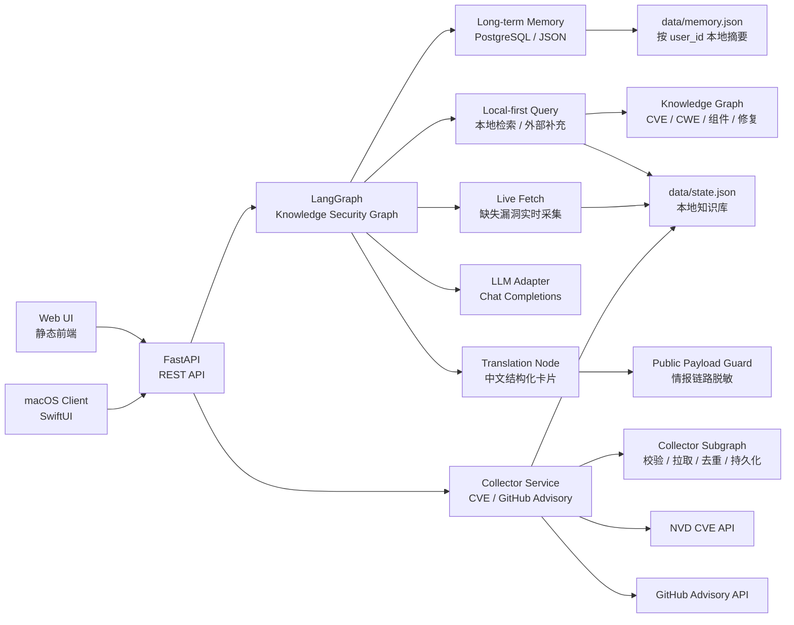

# SecFlow Knowledge Security Assistant

<p align="center">
  <b>面向 AI 安全攻防、漏洞知识库与安全研发场景的轻量级 LangGraph 知识库安全助手</b>
</p>

<p align="center">
  
  
  
  
</p>

> 作者：**ShenSiQi**  
> 许可证：**SecFlow Source-Available Commercial Non-Redistribution License**  
> 说明：本仓库源码公开用于审阅、学习和评估，但不是 OSI 意义上的开源许可证；未经书面商业授权，不允许再分发、转售、SaaS 包装或商用交付。

---

## macOS 双架构试用版

macOS 智能体模块已经从 SecFlow AI 平台中独立发布，源码与构建入口均位于本仓库 `main` 分支。版本 `v1.2.0` 提供 Apple Silicon 和 Intel Mac 两个三天试用包，首次启动后连续可用 72 小时：

| 平台 | 下载 | 适用设备 |
| --- | --- | --- |
| Apple Silicon `arm64` | [SecFlow-Trial-3Days-macOS-arm64.zip](https://github.com/FuNianTongXue/secflow-knowledge-security-assistant/releases/download/v1.2.0-macos-agent-trial/SecFlow-Trial-3Days-macOS-arm64.zip) | M1 / M2 / M3 / M4 系列 Mac |
| Intel `x86_64` | [SecFlow-Trial-3Days-macOS-x86_64.zip](https://github.com/FuNianTongXue/secflow-knowledge-security-assistant/releases/download/v1.2.0-macos-agent-trial/SecFlow-Trial-3Days-macOS-x86_64.zip) | Intel Mac，也可在 Rosetta 下运行 |

客户端最低支持 macOS 14。发布包采用 ad-hoc 签名，未经过 Apple Developer ID 公证；在其他 Mac 首次打开时，可能需要在 Finder 中右键选择“打开”。完整校验值、变更记录和许可证说明见 [GitHub Release](https://github.com/FuNianTongXue/secflow-knowledge-security-assistant/releases/tag/v1.2.0-macos-agent-trial)。

### 独立模块边界

| 模块 | 目录 | 内容 |
| --- | --- | --- |
| macOS 前端 | `macos/SecFlowMac/Sources/SecFlowMac` | SwiftUI 登录、总览、智能问答、资讯、知识图谱、漏洞库、报告和设置界面 |
| 智能体后端 | `app/` | FastAPI API、LangGraph 编排、长期记忆、情报查询、依赖分析、代码审计和报告生成 |
| 静态分析规则 | `config/semgrep/` | Java、Python、Go、C/C++、Rust、Solidity 离线规则 |
| 桌面打包 | `scripts/build_macos_app.sh`、`scripts/build_macos_trial_app.sh` | 内嵌后端、Semgrep、Tree-sitter 语法模块、许可证、签名与双架构校验 |

试用状态在后端统一校验，界面倒计时不是授权依据。到期、检测到系统时间回拨或状态损坏后，原生界面会锁定，核心 `/api` 请求返回 `403`。状态使用加密文件与 macOS Keychain 双副本保存；离线限时无法做到绝对不可破解，但删除单一副本或普通卸载重装不会重置试用期。

## 项目定位

SecFlow Knowledge Security Assistant 是从 SecFlow AI 平台中抽取出的精简版知识库安全助手。它使用 LangGraph 组织安全问答流程，通过 FastAPI 提供后端服务，通过轻量前端完成漏洞情报采集配置，并支持长期记忆、跨会话上下文召回、中文结构化漏洞卡片、版本事实约束、客户可见信息脱敏和 OpenAI-compatible LLM 调用诊断。

默认情况下，它只用本地 JSON 文件运行：采集配置与漏洞情报保存在 `data/state.json`，每个 `user_id` 的问答历史和压缩摘要保存在 `data/memory.json`。模型层支持 DeepSeek / OpenAI / Ollama / vLLM 等兼容 Chat Completions 的服务。

它适合用于：

- AI 安全问答原型验证
- CVE / GHSA 漏洞知识库采集配置演示
- LangGraph 安全 Agent 工作流学习
- 安全研发平台的知识库助手雏形
- 内部安全工具 PoC 与轻量部署

## 核心特性

| 能力 | 说明 |
| --- | --- |
| LangGraph 安全问答 | 按 `分类 -> 记忆召回 -> 条件检索 -> 模型回答 -> 记忆持久化` 组织节点流程 |
| CVE 采集配置 | 支持 NVD API URL、API Key、严重等级、集合名、最大采集量等配置 |
| GitHub Advisory 配置 | 支持 GitHub Advisory API、Token、生态过滤、严重等级、集合名等配置 |
| 本地知识库 | 默认使用 `data/state.json` 存储采集配置和漏洞记录 |
| 长期记忆 | 按 `user_id` 本地持久化，自动压缩摘要、重要性评分和跨会话召回 |
| 情报查询与富化 | 查询本地情报库并并发补充 NVD、GitHub Advisory、OSV，按别名归并后写回本地 |
| 信息咨询 | 聚合 FreeBuf、阿里先知、腾讯安全、腾讯玄武、CISA、Microsoft、Cisco Talos、PortSwigger 和 SANS ISC 等无需密钥且可直连的公开端点，支持缓存、去重、分类、搜索和来源订阅 |
| 知识图谱 | 从 CVE/GHSA、CWE、组件、影响版本和修复版本生成可交互节点与关系 |
| LLM 适配 | 支持 DeepSeek、OpenAI、Ollama、vLLM 等 OpenAI-compatible Chat Completions |
| 智能路由 | CVE / GHSA 编号问题优先走漏洞 RAG；带年份的漏洞/CVE/高危/最新问题会先查本地 RAG 并调用 CVE 接口补充最新记录 |
| 中文卡片子节点 | 独立 LangGraph 节点将漏洞事实整理为中文卡片，固定输出编号、名称、描述、CVSS、严重等级、涉及版本、修复版本、修复方案、缓释措施和代码片段 |
| 版本事实保护 | 通配符不会被解释为“所有版本”；修复版本只接受结构化事实，缺失时明确显示“未明确” |
| 情报链路保护 | 问答响应不返回来源名称、来源 URL、内部集合名、检索链路或参考链接，历史记忆同样保存脱敏后的结果 |
| 中文严重等级 | 严重、高危、中危、低危分别使用红、黄、绿、蓝状态标签展示 |
| 前端控制台 | 单页静态前端，支持问答、采集配置、测试连接、执行采集、查看 Trace |
| macOS 客户端 | 原生 SwiftUI 客户端，按安全智脑设计稿提供总览、问答、情报采集、知识图谱、漏洞库与查询源配置 |
| 采集器子图 | 按 `配置校验 -> 拉取 -> 规范化去重 -> 持久化 -> 结果汇总` 独立编排，供手动采集与问答补采复用 |
| 密钥脱敏 | API 响应中自动隐藏 NVD API Key 与 GitHub Token |
| 凭证启用门禁 | CVE API Key 或 GitHub Token 必须先填写并保存，随后才允许测试连接或采集 |
| 低依赖部署 | 未配置数据库或 LLM 时自动退化为 JSON 记忆与本地专家建议 |

## 架构设计



### LangGraph 节点

```text
classify_query
  -> load_memory_context
    -> query_intelligence       # 本地情报优先，并发查询外部接口后写回
      -> enrich_knowledge_graph # 关联 CVE/GHSA、CWE、组件与修复版本
        -> call_llm
          -> translate_vulnerability_card
            -> compose_answer
              -> persist_memory
```

| 节点 | 作用 |
| --- | --- |
| `classify_query` | 判断用户问题属于 CVE / GHSA 查询、年份漏洞查询、供应链安全、合规或通用安全知识 |
| `load_memory_context` | 读取用户长期记忆，完成历史召回、摘要压缩和上下文拼接 |
| `query_intelligence` | 本地优先查询 CVE / GHSA，并发补充外部结果、别名归并和本地写回 |
| `enrich_knowledge_graph` | 生成漏洞、公告、CWE、组件、影响范围和修复版本之间的图关系 |
| `call_llm` | 调用 OpenAI-compatible 模型，并返回真实错误诊断 |
| `translate_vulnerability_card` | 将漏洞事实和分析结果翻译整理为严格中文字段，并校验涉及版本与修复版本不被模型改写或猜测 |
| `compose_answer` | 汇总检索结果、模型输出、执行 Trace 与置信度，返回结构化答案 |
| `persist_memory` | 将脱敏后的本轮问答写入长期记忆，并更新用户画像摘要 |

## 目录结构

```text
.
├── app
│   ├── collectors.py      # CVE / GitHub Advisory 采集、测试、配置保存
│   ├── collector_graph.py # LangGraph 采集器子图
│   ├── graph.py           # LangGraph 知识库安全助手工作流
│   ├── llm.py             # OpenAI-compatible LLM 适配与诊断
│   ├── main.py            # FastAPI 入口与 API 路由
│   ├── intelligence.py    # 本地优先查询、多源归并和知识图谱富化
│   ├── memory.py          # 按 user_id 本地 JSON 长期记忆服务
│   ├── models.py          # Pydantic 请求与响应模型
│   ├── privacy.py         # 客户可见问答脱敏与中文严重等级
│   ├── storage.py         # 本地 JSON 状态存储与密钥脱敏
│   └── static
│       ├── index.html     # 前端页面
│       ├── app.css        # 前端样式
│       └── app.js         # 前端交互逻辑
├── scripts
│   ├── smoke.sh           # 最小可用性测试
│   └── build_macos_app.sh # 构建并签名 SecFlow.app
├── macos
│   └── SecFlowMac         # 原生 SwiftUI macOS 客户端
├── tests
│   └── test_privacy.py    # 来源保护、版本事实和严重等级测试
├── Dockerfile             # 容器镜像构建
├── docker-compose.yml     # 单服务部署示例
├── requirements.txt       # Python 依赖
├── LICENSE                # 商业不可再分发源码许可证
└── README.md
```

## 快速开始

### 方式一：本地 Python 启动

```bash
git clone https://github.com/FuNianTongXue/secflow-knowledge-security-assistant.git
cd secflow-knowledge-security-assistant

python -m venv .venv
source .venv/bin/activate
pip install -r requirements.txt

uvicorn app.main:app --reload --host 0.0.0.0 --port 18081
```

访问：

```text
http://127.0.0.1:18081
```

### 方式二：Docker Compose 启动

```bash
git clone https://github.com/FuNianTongXue/secflow-knowledge-security-assistant.git
cd secflow-knowledge-security-assistant

docker compose up -d --build
```

访问：

```text
http://127.0.0.1:18081
```

停止服务：

```bash
docker compose down
```

### 方式三：生产环境 Uvicorn

```bash
SECFLOW_DATA_DIR=/opt/secflow-knowledge/data \
uvicorn app.main:app --host 0.0.0.0 --port 18081 --workers 2
```

建议在生产环境前面增加 Nginx / Caddy / Ingress，并将 `data/` 挂载为持久化目录。

### 方式四：macOS 原生智能体客户端

开发运行可连接单独启动的后端：

```bash
SECFLOW_SERVER_URL=http://127.0.0.1:18081 swift run --package-path macos/SecFlowMac
```

构建包含本地后端、可直接打开的独立应用包：

```bash
.venv/bin/python -m pip install -r requirements-macos.txt
bash scripts/build_macos_app.sh
open dist/SecFlow.app
```

构建 Apple Silicon 三天试用版：

```bash
bash scripts/build_macos_trial_app.sh
```

构建 Intel 三天试用版时，`PYTHON_BIN` 必须指向 x86_64 Python 及其依赖环境：

```bash
SECFLOW_MACOS_ARCH=x86_64 \
PYTHON_BIN=/path/to/x86_64/venv/bin/python \
bash scripts/build_macos_trial_app.sh
```

两个产物分别写入 `dist-macos-trial/SecFlow-Trial-3Days-macOS-arm64.zip` 和 `dist-macos-trial/SecFlow-Trial-3Days-macOS-x86_64.zip`，互不覆盖。

客户端最低支持 macOS 14。发布版不连接现有容器服务，应用会管理自己的回环后端，并将全部运行数据写入 `~/Library/Application Support/SecFlow`。

macOS 发布包内置离线多语言静态分析 CLI、SecFlow 安全规则和 Tree-sitter AST/CFG/DFG 分析运行库，支持 Java、Python、Go、C、C++、Rust 与 Solidity，客户无需安装扫描工具。Java 路径分析支持跨方法传播；新增语言输出文件内结构化 CFG、赋值级 DFG，并与 Semgrep source→sink taint 路径合并。构建脚本会验证真实 CLI、全部离线规则、七种语法模块和 taint 扫描结果，并随应用保留 LGPL-2.1、MIT 许可证与第三方声明；详见 [macOS 构建说明](macos/SecFlowMac/README.md)。

OWASP BenchmarkJava 与高星 Java 项目的性能及误报/漏报评估见 [Java 自动化代码审计评估](docs/semgrep-java-audit-evaluation-2026-07-17.md)。

100 个随机高星 Go 项目的 OWASP 基线结果、多语言带标签烟测和统计限制见 [多语言静态分析与 Go 基线评估](docs/multilang-static-analysis-and-go-evaluation-2026-07-21.md)。

随机 598 个外部 Go 正例与 598 个反例的冻结资格评测见 [Go 外部语料 598×2 资格评测](docs/go-external-598x2-qualification-2026-07-22.md)。

## 环境变量

| 变量 | 默认值 | 说明 |
| --- | --- | --- |
| `SECFLOW_DATA_DIR` | `data` | 运行态配置和知识库记录存储目录 |
| `DATABASE_URL` / `POSTGRES_DSN` | 空 | PostgreSQL 长期记忆连接串；为空时使用 `data/memory.json` |
| `SECFLOW_MEMORY_MAX_HISTORY` | `300` | 每个用户保留的最大历史问答数 |
| `SECFLOW_MEMORY_RECENT_LIMIT` | `6` | 注入模型的最近对话条数 |
| `SECFLOW_MEMORY_RETRIEVAL_LIMIT` | `5` | 跨会话相关记忆召回条数 |
| `SECFLOW_MEMORY_CONTEXT_CHARS` | `3000` | 注入模型的长期记忆上下文最大字符数 |
| `SECFLOW_MEMORY_LOCAL_ONLY` | `true` | 强制按用户使用本地 JSON 摘要记忆；设为 `false` 才允许 PostgreSQL |
| `SECFLOW_LLM_PROVIDER` | `deepseek` / `openai` | LLM Provider 名称，支持 DeepSeek、OpenAI、Ollama、vLLM 等 |
| `SECFLOW_LLM_ENDPOINT` | 按 Provider 推断 | OpenAI-compatible API Base URL，例如 `https://api.deepseek.com/v1` |
| `SECFLOW_LLM_MODEL` | 按 Provider 推断 | Chat Completions 模型名称 |
| `SECFLOW_LLM_API_KEY` | 空 | LLM API Key，也可使用 `DEEPSEEK_API_KEY` 或 `OPENAI_API_KEY` |
| `SECFLOW_LLM_MAX_TOKENS` | `1800` | 单次回答最大 token 数 |
| `SECFLOW_LLM_TEMPERATURE` | `0.25` | 模型温度 |
| `SECFLOW_LLM_TIMEOUT_MS` | `60000` | 模型请求超时时间 |
| `SECFLOW_SEMGREP_BIN` | 应用内 CLI | 开发环境覆盖 Semgrep 可执行文件路径 |
| `SECFLOW_SEMGREP_RULES` | 内置规则目录 | 开发环境覆盖离线多语言规则目录或单个规则文件 |
| `SECFLOW_SEMGREP_TIMEOUT_SECONDS` | `180` | 单次附件静态分析总超时 |
| `SECFLOW_SEMGREP_RULE_TIMEOUT_SECONDS` | `15` | 单个规则处理单文件的超时 |
| `SECFLOW_TRIAL_ENABLED` | 空 | 打包版内部开关；启用后由后端执行 72 小时试用限制 |
| `SECFLOW_KEYCHAIN_SERVICE` | `com.secflow.ai.mac.intelligence` | 本地加密主密钥使用的 macOS Keychain 服务名 |

> NVD API Key 与 GitHub Token 默认从前端配置页写入本地状态文件，不建议提交到 Git。LLM API Key 建议通过环境变量注入，不要写入源码。

## 使用说明

### 1. 打开控制台

启动服务后访问：

```text
http://127.0.0.1:18081/ui
```

页面包含三块核心区域：

- 安全知识问答：输入安全问题，查看长期记忆、模型状态和 LangGraph Trace
- 采集配置：配置 CVE 与 GitHub Advisory 采集源
- 知识记录：查看本地漏洞知识记录

### 2. 配置 CVE 漏洞库

在 `CVE Vulnerability Database` 卡片中配置：

- Enabled：是否启用采集
- NVD API URL：默认 `https://services.nvd.nist.gov/rest/json/cves/2.0`
- NVD API Key：必填；必须保存后才允许测试连接或采集
- Collection：默认 `cve`
- Severity Filter：如 `CRITICAL,HIGH,MEDIUM`
- Max Results：单次采集最大数量
- Interval Minutes：计划采集间隔配置项

年份漏洞查询会遵循 NVD API 2.0 的日期区间限制拆分请求，优先读取每个窗口中最新发布的结果，并兼容 NVD 2.0 引用数组与 CVSS v4 严重等级。部分年份请求失败时会保留已成功年份和本地 RAG 结果，不中断最终回答。

### 3. 配置 GitHub Advisory

在 `GitHub Advisory` 卡片中配置：

- Enabled：是否启用采集
- API URL：默认 `https://api.github.com/advisories`
- GitHub Token：必填；必须保存后才允许测试连接或采集
- Collection：默认 `github_advisory`
- Severity Filter：如 `critical,high,medium`
- Ecosystem：如 `npm`、`pip`、`maven`，可为空
- Max Results：单次采集最大数量

### 4. 提问示例

```text
解释 CVE-2021-44228 的影响和修复建议
```

```text
GHSA-jfh8-c2jp-5v3q 的影响是什么？
```

```text
2025 年最新的高危 CVE 漏洞有哪些？
```

```text
今年有哪些值得关注的 CVE 漏洞？
```

```text
我们应该如何降低软件供应链安全风险？
```

当问题包含具体漏洞编号时，系统会先核验内部安全知识；事实不足时补充记录，再由中文整理子节点输出固定字段卡片。问答 API 和页面只展示客户需要的漏洞事实与处置建议，不展示情报供应商、来源 URL、内部集合名、检索链路和参考链接。非漏洞类问题不会强行走漏洞检索，会将长期记忆、最近会话和相关历史上下文注入 LLM 后回答；如果 LLM 未配置或接口失败，则返回本地安全专家降级建议。

## API 文档

启动服务后可访问：

```text
http://127.0.0.1:18081/docs
```

常用 API：

| Method | Path | 说明 |
| --- | --- | --- |
| `GET` | `/health` | 健康检查 |
| `GET` | `/api/config` | 获取采集配置、知识库记录与统计 |
| `PATCH` | `/api/config/{collector_id}` | 更新采集配置 |
| `POST` | `/api/config/{collector_id}/test` | 测试采集源连接 |
| `POST` | `/api/collect/{collector_id}` | 执行采集 |
| `GET` | `/api/vulnerabilities` | 查看本地漏洞记录 |
| `GET` | `/api/dashboard` | 获取基于本地情报库的总览统计 |
| `GET` | `/api/intelligence/sources` | 获取实时查询源与最近采集状态 |
| `GET` | `/api/intelligence/recent` | 获取当前进程最近查询结果 |
| `POST` | `/api/intelligence/query` | 本地检索、外部补充、写回并生成图谱 |
| `GET` | `/api/information` | 获取公开安全资讯，可按关键词、分类和排序筛选 |
| `POST` | `/api/information/refresh` | 立即刷新已启用的公开资讯来源 |
| `PATCH` | `/api/information/sources/{source_id}` | 启用或暂停指定资讯来源 |
| `POST` | `/api/knowledge-graph/query` | 返回富化后的知识图谱节点与边 |
| `POST` | `/api/ask` | 调用知识库安全助手 |
| `GET` | `/api/graph` | 查看 LangGraph 节点与边定义 |
| `GET` | `/api/collector-graph` | 查看采集器子图节点与边定义 |
| `GET` | `/api/runtime` | 查看 LLM 与长期记忆运行状态 |
| `GET` | `/api/trial/status` | 获取三天试用状态、首次启动时间、到期时间和剩余秒数 |
| `DELETE` | `/api/memory` | 清空指定用户长期记忆 |

采集器 ID：

```text
cve
github_advisory
```

问答请求示例：

```bash
curl -X POST http://127.0.0.1:18081/api/ask \
  -H 'Content-Type: application/json' \
  -d '{"question":"解释 CVE-2021-44228 的影响和修复建议","top_k":5,"user_id":"default","session_id":"demo"}'
```

查看运行状态：

```bash
curl http://127.0.0.1:18081/api/runtime
```

具体漏洞问答返回 `vulnerability_card`，字段固定为：

```text
漏洞编号
漏洞名称
漏洞描述
CVSS评分
严重等级
涉及版本
修复版本
修复方案
缓释措施
代码片段
```

该响应不会包含 `sources`、来源 URL、参考链接或内部集合名。

## 验证与测试

安装依赖后执行：

```bash
PATH=".venv/bin:$PATH" bash scripts/smoke.sh
```

成功时输出：

```text
smoke-ok
```

也可以手动检查：

```bash
curl http://127.0.0.1:18081/health
curl http://127.0.0.1:18081/api/graph
curl http://127.0.0.1:18081/api/collector-graph
swift test --package-path macos/SecFlowMac
```

## 部署建议

### 单机部署

适合 PoC、内部演示和轻量使用：

```text
Uvicorn + data/state.json + data/memory.json
```

优点是依赖少、启动快；缺点是长期记忆并发写入和审计能力有限。

### 容器部署

适合内部环境统一托管：

```text
Docker Compose + PostgreSQL + 持久化 data volume
```

`docker-compose.yml` 会将 `./data` 挂载到宿主机保存采集配置、本地漏洞记录和按用户生成的问答摘要。当前默认 `SECFLOW_MEMORY_LOCAL_ONLY=true`，即使存在 PostgreSQL 连接也不会用于问答记忆。

### 平台化扩展

如果要接入企业级知识库，可将当前模块扩展为：

```text
FastAPI
  -> LangGraph
  -> Long-term Memory / Vector DB / Graph DB
  -> LLM Gateway
  -> Collector Scheduler
```

可替换方向：

- `data/state.json` 替换为 PostgreSQL / SQLite
- 长期记忆表替换为企业统一用户画像或审计库
- 本地检索替换为 Milvus / pgvector
- 采集触发替换为 Celery / APScheduler / Temporal
- 问答生成接入企业 LLM 网关

## 安全设计

- API 响应会脱敏 `api_key` 与 `token`
- 问答响应会移除来源名称、来源 URL、参考链接、内部集合名和检索链路
- 中文卡片节点只允许结构化事实提供涉及版本与修复版本；没有修复版本时返回“未明确”
- CVE API Key 与 GitHub Token 必须先保存，未保存凭证时禁止测试和采集
- `data/*.json` 默认被 `.gitignore` 忽略
- 不内置任何真实密钥
- 不默认上传采集数据到第三方服务
- LLM 调用失败会返回真实诊断，但不会回显密钥
- 长期记忆只保存已经过客户可见信息脱敏的问答结果；如需处理敏感数据，建议在网关层继续增加业务脱敏策略
- GitHub 仓库公开不代表允许再分发或商用

## 2026-07-14 更新

- 新增 LangGraph `translate_vulnerability_card` 中文整理子节点
- 漏洞卡片固定输出编号、名称、描述、CVSS、中文严重等级、涉及版本、修复版本、修复方案、缓释措施和代码片段
- 新增版本事实保护：忽略通配符版本，不把 `*` 展示为“所有版本”，不允许模型猜测修复版本
- 新增客户可见信息保护：回答、执行 Trace 和长期记忆不再暴露情报来源、URL、集合名与检索链路
- 新增红 / 黄 / 绿 / 蓝中文严重等级状态组件
- CVE 与 GitHub 漏洞采集增加“先保存凭证，再测试或采集”的启用门禁
- 新增隐私、版本事实和中文严重等级自动化测试

## 2026-07-21 macOS 智能体独立发布

- 独立提交 SwiftUI macOS 前端和 FastAPI/LangGraph 智能体后端，不依赖 SecFlow AI 平台仓库运行
- 新增总览、智能问答、公开安全资讯、知识图谱、漏洞库、分析报告、用户设置和多语言界面
- 新增 Maven/Gradle 依赖解析、Java 跨方法 AST/CFG/DFG 分析，以及 Python、Go、C/C++、Rust、Solidity 文件内数据流分析
- 发布包内嵌 Semgrep OSS 1.170.0、七种语言离线规则、Tree-sitter 语法模块和第三方许可证
- 本地状态、长期记忆、漏洞目录和报告使用加密存储；macOS 主密钥由 Keychain 管理
- 新增首次启动起连续 72 小时的试用机制、Keychain 双副本、设备/用户绑定和系统时间回拨检测
- 新增 Apple Silicon `arm64` 与 Intel `x86_64` 两个可下载版本
- Python 测试、SwiftUI 模型与渲染测试、包内后端试运行、Semgrep 多语言规则烟测和 Mach-O 架构扫描均纳入发布校验

## 路线图

- [ ] 增加定时采集调度器
- [x] 增加按 `user_id` 隔离的本地摘要记忆
- [x] 增加 OpenAI-compatible LLM Provider 适配
- [ ] 增加 SQLite 存储选项
- [ ] 增加向量检索适配层
- [ ] 增加采集任务执行日志
- [ ] 增加 Docker 镜像发布流程
- [ ] 增加更多安全知识源适配器
- [x] 增加中文结构化漏洞卡片子节点
- [x] 增加问答情报链路脱敏
- [x] 增加版本事实保护和中文严重等级

## 常见问题

### 这是开源项目吗？

本仓库源码公开可见，但许可证不是 OSI 开源许可证。你可以学习、审阅和评估；未经书面商业授权，不允许再分发、转售、SaaS 包装或商用交付。

### 必须配置 PostgreSQL 才能使用吗？

不需要。默认强制使用 `data/memory.json`，按 `user_id` 隔离历史、事实和压缩摘要。只有显式设置 `SECFLOW_MEMORY_LOCAL_ONLY=false` 时才会尝试 PostgreSQL。

### 没有 LLM API Key 能用吗？

可以。CVE / GitHub Advisory 采集、测试和本地知识库检索仍可使用；非漏洞问题会返回本地安全专家降级建议。配置 `SECFLOW_LLM_API_KEY`、`DEEPSEEK_API_KEY` 或 `OPENAI_API_KEY` 后，系统会把长期记忆和上下文注入模型回答。

### 没有 NVD API Key 能用吗？

实时按编号查询可以不配置 Key，但会受到较严格的公共限流。手动批量采集与连接测试仍要求先保存 NVD API Key。

### GitHub Token 会提交到仓库吗？

不会。Token 写入运行态 `data/state.json`，该文件默认被 `.gitignore` 忽略。

## 许可证

本项目采用 [SecFlow Source-Available Commercial Non-Redistribution License](./LICENSE)。

核心限制：

- 允许阅读、学习、评估和内部非生产测试
- 未经授权禁止再分发
- 未经授权禁止商业使用
- 未经授权禁止 SaaS / 托管服务包装
- 不得移除作者、版权与许可证声明

## 作者

**ShenSiQi**
